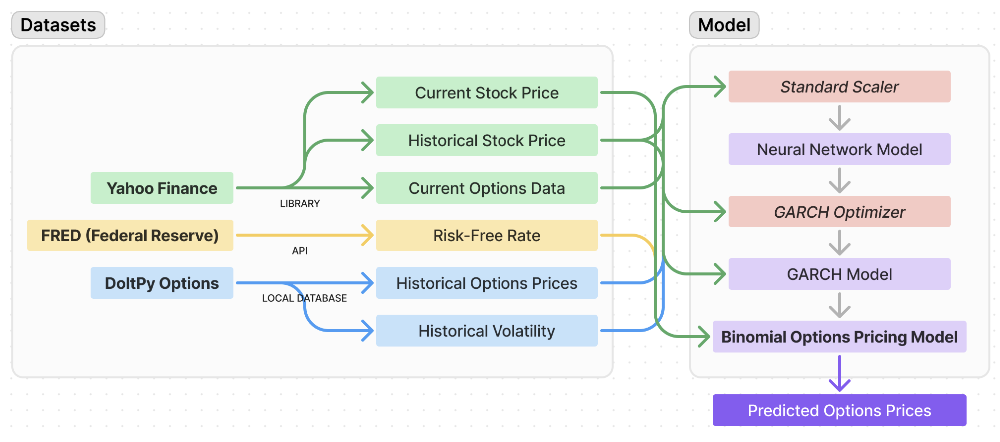

# Neural Networks for Volatility Estimation in Options Pricing
# Artificial Intelligence Final Project - CS7375

I contributed to this project as part of the graduate-level Artificial Intelligence course (CS7375) at Kennesaw State University in Spring 2024. This ambitious and experimental undertaking was conducted in collaboration with my teammates, Estevao Bittencourt and Aidan Mitchell. The aim of the project was to enhance the traditional binomial options pricing model using a neural network and GARCH (Generalized Autoregressive Conditional Heteroskedasticity) model to hopefully achieve a more accurate estimation of option prices by dynamically predicting volatility. This hybrid approach leveraged modern machine learning alongside classical econometric modeling. Due to the time scope of the project and limited availability of free data, we were not able to comprehensively assess the accuracy of the model within the semester, so that assessment is ongoing.

## Overview of the Analysis

### 1) Introduction and Problem Statement
The project aimed to address the limitations of traditional options pricing models, such as the Black-Scholes and Binomial models, which assume constant volatility. Financial markets, however, often exhibit volatility clustering, jumps, and stochastic behavior that these models cannot capture effectively. Our solution involved integrating a neural network to predict volatility, feeding its output into a GARCH model, and using these enhanced volatility estimates to refine the binomial options pricing model.

To see the our academic report, please view the PDF in the repository.

  

### 2) Data Acquisition and Preprocessing
- **Initial Data Sources**: Data was obtained using **'yfinance'** for historical stock prices and options data, while economic indicators, such as the risk-free rate, were pulled from **FRED (Federal Reserve Economic Data)** using **'fredapi'**.
- **SQL Database Management**: Historical data, such as volatility and options chain data, was stored in a local SQL database managed with **'doltpy'** and **'pymysql'**, updated three times per week to maintain the dataset's currency.
- **Data Cleaning and Preparation**: Pandas was used for data merging and feature creation. Feature scaling was implemented with **StandardScaler** from `sklearn.preprocessing` to normalize the data for neural network input. Data included features such as historical price returns, implied volatility, option type, and strike prices.

### 3) Neural Network for Volatility Prediction
- **Architecture and Implementation**: A **neural network** was constructed using **PyTorch** with three fully connected layers. The activation function was **ReLU**, and the network aimed to learn complex patterns in market volatility from historical price data and other market indicators.
- **Training**: The model was trained on historical returns data using **mean squared error (MSE)** as the loss function and optimized with **Adam** optimizer to predict future volatility. This predicted volatility was intended to capture dynamic changes more effectively than traditional GARCH estimates alone.

### 4) GARCH Model Integration
- **Dynamic Volatility Modeling**: The **GARCH(1,1) model** was applied to predict time-varying volatility of stock returns. To enhance the accuracy of these predictions, the parameters of the GARCH model were dynamically adjusted based on the neural network’s output, leveraging the strengths of both methodologies.

### 5) Binomial Options Pricing Model Enhancement
- **Final Integration**: The enhanced GARCH model, incorporating the neural network-predicted volatility, was integrated into the **Cox-Ross-Rubinstein binomial options pricing model**. This combined approach aimed to create a more realistic reflection of market behaviors by dynamically adjusting the volatility assumption in the binomial pricing process.
- **Option Pricing Calculation**: The model used a binomial tree framework for option pricing, with nodes representing future asset prices under different volatility scenarios. Each node value was discounted back to the present using the risk-free rate obtained from FRED.

### 6) Evaluation and Results
- **Model Performance Metrics**: We evaluated the model by comparing predicted option prices to actual market prices. Metrics used for evaluation included **Root Mean Squared Error (RMSE)** and **Mean Absolute Percentage Error (MAPE)**.
- **Comparison to Conventional Models**: Preliminary results indicate that the hybrid model provided improved accuracy in predicting option prices compared to traditional methods relying solely on historical volatility estimates. The **dynamically predicted volatility** allowed the model to better capture the true volatility of the underlying asset, resulting in more accurate pricing.

### 7) Key Findings and Insights
- **Improved Accuracy**: Integrating neural networks with GARCH provided a dynamic, data-driven way to model market volatility, and we believe this leads to a more precise and adaptable pricing mechanism compared to the traditional binomial model.
- **Scalability and Flexibility**: The modular nature of the model allowed for easy retraining of the neural network with new data, enabling continual updates and maintaining the model's relevance over time.
- **Real-Time Data Utilization**: The use of **real-time financial data** via `yfinance` and `fredapi` enhanced the model's practicality and applicability to current market conditions.
- **Drawbacks**: While the model demonstrated significant potential, it also posed challenges due to the **complexity of implementation**, **computational intensity**, and the **risk of overfitting** when training the neural network.

## Summary of Analysis
Our project integrates a neural network and a GARCH model within the binomial options pricing framework to address the assumption of constant volatility in traditional options pricing. We utilized real-time and historical data from 'yfinance', managed through local SQL databases, to train a PyTorch neural network for predicting market volatility. This forecasted volatility was refined with a GARCH model to enhance the binomial model’s pricing accuracy.
Despite its promise, the model’s complexity and computational demands pose challenges. Future work will involve rigorous testing against actual market prices to validate its effectiveness and practical utility. This project highlights the potential of computational finance to improve financial modeling techniques.

 
